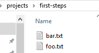

# Git: Distributed Version Control Fundamentals and Workflows  
  Git学习指南  
  图书阅读摘记  

## 目录  

- [Git: Distributed Version Control Fundamentals and Workflows](#git-distributed-version-control-fundamentals-and-workflows)
  - [目录](#目录)
  - [第一章 基本概念](#第一章-基本概念)
  - [第二章 入门](#第二章-入门)
    - [2.1 准备git环境](#21-准备git环境)
    - [2.2 第一个git项目](#22-第一个git项目)
    - [2.3 Git的协作功能](#23-git的协作功能)
    - [2.4 本章小结](#24-本章小结)
  - [第三章 提交究竟是什么](#第三章-提交究竟是什么)
    - [3.1 访问权限与时间戳](#31-访问权限与时间戳)
    - [3.2 add命令与commit命令](#32-add命令与commit命令)
    - [3.3 再谈提交散列值](#33-再谈提交散列值)
    - [3.4 提交历史](#34-提交历史)
    - [3.5 一种略有不同的提交查看方法](#35-一种略有不同的提交查看方法)
    - [3.6 同一项目的多部不同历史](#36-同一项目的多部不同历史)
  - [第四章 多次提交](#第四章-多次提交)
    - [4.1 status](#41-status)
    - [4.2 存储在暂存区中的快照](#42-存储在暂存区中的快照)
    - [4.3 怎样的修改不该被提交](#43-怎样的修改不该被提交)
    - [4.4 用.gitignore忽略非版本控制文件](#44-用gitignore忽略非版本控制文件)
    - [4.5 储藏](#45-储藏)
  - [第五章 版本库](#第五章-版本库)
    - [5.1 一种简单而高校的存储系统](#51-一种简单而高校的存储系统)
    - [5.2 存储目录：Blob与Tree](#52-存储目录blob与tree)
    - [5.3 相同数据只存储一次](#53-相同数据只存储一次)
  - [第六章 分支](#第六章-分支)
    - [6.1 并行式开发](#61-并行式开发)
    - [6.2 修复旧版本中的bug](#62-修复旧版本中的bug)
    - [6.4 当前活跃分支](#64-当前活跃分支)
    - [6.6 重置分支指针](#66-重置分支指针)
    - [6.7 删除分支](#67-删除分支)
    - [6.8 清理提交对象](#68-清理提交对象)
  - [第七章 合并分支](#第七章-合并分支)
    - [7.2 冲突](#72-冲突)
    - [7.3 编辑冲突](#73-编辑冲突)
    - [7.4 冲突标志](#74-冲突标志)
    - [7.5 解决编辑冲突](#75-解决编辑冲突)
    - [7.6 内容冲突](#76-内容冲突)
    - [7.7 开进合并](#77-开进合并)
    - [7.8 第一父级提交历史](#78-第一父级提交历史)
    - [7.9 棘手的合并冲突](#79-棘手的合并冲突)
    - [7.10 终有可行的方式](#710-终有可行的方式)
  - [第八章 通过变基净化历史](#第八章-通过变基净化历史)
    - [8.2 避免钻石链](#82-避免钻石链)
    - [8.3 什么情况下会遇到冲突呢](#83-什么情况下会遇到冲突呢)
    - [8.4 移植分支](#84-移植分支)
    - [8.5 执行变基后原提交的情况](#85-执行变基后原提交的情况)
    - [8.7 捡取](#87-捡取)
  - [第九章 版本库间的交换](#第九章-版本库间的交换)
    - [9.1 克隆版本库](#91-克隆版本库)
    - [9.2 如何告知Git其他版本库的位置](#92-如何告知git其他版本库的位置)
    - [9.3 给别处的版本库起个名字](#93-给别处的版本库起个名字)
    - [9.4 获取数据](#94-获取数据)
    - [9.5 远程跟踪分支：监控其他分支](#95-远程跟踪分支监控其他分支)
    - [9.6 利用本地分支操作别处的版本库](#96-利用本地分支操作别处的版本库)
    - [9.7 Pull = Fetch + Merge](#97-pull--fetch--merge)
    - [9.8 讨厌钻石链的人：请用--rebase选项](#98-讨厌钻石链的人请用--rebase选项)
    - [9.9 Push: Pull的反面](#99-push-pull的反面)
    - [9.10 命名分支](#910-命名分支)
  - [第十章 版本标签](#第十章-版本标签)
    - [10.1 创建标签](#101-创建标签)
    - [10.2 当前究竟存在哪些标签](#102-当前究竟存在哪些标签)
    - [10.3 打印标签的散列值](#103-打印标签的散列值)
    - [10.4 将标签添加到日志输出中](#104-将标签添加到日志输出中)
    - [10.5 究竟在哪个版本里呢](#105-究竟在哪个版本里呢)
    - [10.6 如何修改标签呢](#106-如何修改标签呢)
    - [10.7 当我们需要一个浮动标签时](#107-当我们需要一个浮动标签时)

---
## 第一章 基本概念  
略  

---
## 第二章 入门  
### 2.1 准备git环境  
1. git官网下载安装git  
2. 用config配置git，如配置用户名和邮箱：  
```shell
$ git config --global user.email "user@service.site"  
```  
### 2.2 第一个git项目  

fisrt-steps目录下有两个文件，如下图所示：  
  
1. 创建版本库
```shell
$ cd /target/dir/projects/first-steps  
$ git init  
```
2. 首次提交  

第一步，add文件。  
第二步，commit，完成后会有一个散列值标识本次提交。  
```shell
$ git add foo.txt bar.txt  
$ git commit --message "Sample project imported."  
```  
3. 检查状态  
```shell
$ git status  
```  
用diff显示每个被修改的行  
```shell
$ git diff your.file  
```  

4. 提交修改  

所有修改都必须先被归档成一次新提交。添加使用add命令，删除使用rm命令。  
```shell
$ git add your.file1 your.file2  
$ git rm your.file3  
```
然后提交修改  
```shell
$ git commit --message "your changes"  
$ git commit -m "your changes"  
```

5. 显示历史  
```shell
$ git log  
```

### 2.3 Git的协作功能  
1. 克隆版本库  
```shell
$ git clone /projects/first-steps /projects/first-steps-clone
```
2. 从另一版本库中获取修改  

在原始库中常见一次新提交：  
```shell
$ cd /projects/first-steps  
$ git add foo.txt  
$ git commit -m "A change in the original."  
```
查看修改日志  
```shell
$ git log --oneline
```
修改克隆版本库中的文件：  
```shell
$ cd /projects/first-steps-clone  
$ git add bar.html  
$ git commit -m "A change in the clone"  
$ git log --oneline  
```
把原版本库中的新提交克隆给它的克隆体。  
```shell
$ cd /projects/first-steps-clone  
$ git pull  
```
pull命令取回了新的修改，并于克隆体的本地修改进行对比，并在工作区合并了两边的修改，创建了一次新提交。  
该过程就是所谓的合并（merge）。注意：合并可能会带来冲突，然后合并就会失败。图形显示修改log。  
```shell
$ git log --graph
```

3. 从任意版本库中取回修改  

无参情况下，pull命令旨在克隆版本库中发挥作用。也可以用参数指定任意版本库的路径，以便从某一特定开发分支中
提取相关修改。  
把克隆体中的修改pull到原版本库，代码如下：  
```shell
$ cd /projects/first-steps  
$ git pull /projects/first-steps-clone master
```

4. 创建共享版本库  

可以用push命令将提交传送给其他版本库。不过，push命令只适合用于那些没有开发者在上面开展具体工作的版本库。
最好的方法就是创建一个不带工作区的版本库（裸版本库，bare repository），可以使用`clone --bare`选项创建
一个裸版本库。裸版本库通常可被用来充当开发者们传递提交（使用push命令）的汇聚点，以便其他人可以从中拉回他
们所做的修改。  
```shell
$ git clone --bare /projects/first-steps /projects/first-steps-bare.git
```

5.  用push命令上载修改  
```shell
$ cd /projects/first-steps 
$ git add foo.txt  
$ git commit -m "changes "  
```
把上述修改向共享版本库传送改提交。  
```shell
$ git push /projects/first-steps-bare.git master
```  

6. Pull命令：取回修改  

让克隆版本库也得到响应的修改
```shell
$ cd /projects/first-steps-clone  
$ git pull /projects/first-steps-bare.git master  
```

### 2.4 本章小结  
* **工作区与版本库**：工作区是一个包含 *.git* 子目录中的目录，我们可以用**init**命令在当前目录中
创建版本库。
* **版本提交**：一次版本提交通常定义了版本库中所有文件的一个版本，它详细说明了该版本是由何人在何时何
地创建的。用**add**命令来确定哪些文件被纳入下一次提交，然后用**commit**命令创建新的版本提交。  
* **查看信息**：通过**status**命令，查看哪些文件被修改和将被提交。此外，**log**用来显示提交历史，
**diff**用来显示两个版本文件之间的差异。  
* **克隆**：用**clone**创建的版本库副本被称为克隆体。  
* **推送和拉回**：**push**和**pull**。  

---
## 第三章 提交究竟是什么  
通过`$ git log --stat -1`查看提交中包含的信息。主要包括：散列值（commit hash）、作者信息、时间、以及修改
内容。  
### 3.1 访问权限与时间戳  
Git会保存每个文件所有的访问权限，但不会保留文件的修改时间。在执行检出操作时，文件的修改时间会被设置为当前
时间。

### 3.2 add命令与commit命令  
通过，提交中会包括当前所有的修改，新增和删除。唯一例外的就是在 **.gitignore**文件中的列出的。  

### 3.3 再谈提交散列值  
* 提交的散列值可以在本地生成。
* 散列值中的信息比单纯的软件版本的名称要多得多。
```shell
# git fsck查看版本库的完整性
$ git fsck
```

### 3.4 提交历史
略。

### 3.5 一种略有不同的提交查看方法
> 通过diff命令，比较出两次提交之间的差异  
> 1. 两次提交  
> 两次提交之间有一份完整的差异清单，在不提交散列值的情况下，靠指定相关特定的符号名称（分支、标签、HEAD等）也
> 能获取到它。  
> `$ git diff 77d231f HEAD`  
> 2. 与上一次提交进行比较  
> ```shell
> # 通过使用^!  
> $ git diff 77d231f^!  
> ```
> 3. 限制文件范围  
> ```shell
> $ git diff 77d231f 05bcfd1 - book/bisection/  
> ```
> 4. 统计修改情况
> ```shell
> # --stat选项显示文件中的修改数量  
> $ git diff --stat 77d231f 05bcfd1  
> ```

### 3.6 同一项目的多部不同历史
```shell
# 部分输出  
$ git log -n 3  # only the last three.  
# 格式化输出： --format, --oneline. --format=fuller可显示更多细节
$ git log --oneline  
# 统计信息  
$ git log --shortstat --oneline  
# 图形显示  
$ git log --graph --oneline  
```

---
## 第四章 多次提交
### 4.1 status
```shell
$ git status
$ git status --short
```
输出选项：  
* changes to be committed
* changed but not updated
* untracked files

### 4.2 存储在暂存区中的快照
```shell
$ git diff -staged  # stageing vs. repository  
$ git diff  # staging vs. workspace  
```
### 4.3 怎样的修改不该被提交

不应提交情况：  
* 调试
* 意外添加
* 尚未准备好
* 自动生成文件
从暂存区中撤回：
```shell
$ git rest HEAD .  
# or  
$ git reset HEAD foo.txt /src/test/  
```
应对方法：  
* **reset**重置
* 写入 _.gitignore_

### 4.4 用.gitignore忽略非版本控制文件
```shell
#
# Simple file path
# 
somehow/test.txt
#
# Directories ending with a "/"
#
generated/
#
# File types as glob expressions
#
*.bak
#
# "!" marked exceptions.
#
!demo.bak
```
注意： _.gitignore_ 文件中的条目只能影响还未提交有Git管理的文件。  

### 4.5 储藏
```shell
# 储存栈（stash stack）  
$ git stash

# 恢复  
$ git stash pop

# 查看  
$ git stash list

# 查看栈中修改内容  
$ git stash pop stash@{1}
```

---
## 第五章 版本库

Git主要由两个层面构成。顶层就是我们所用的命令，例如log、reset或commit等；底层我们称之为管道（plumbing）。  
### 5.1 一种简单而高校的存储系统  

git的核心是一个对象数据库，可用来存储文本或二进制数据。  
```shell
# 插入数据  
$ git hash-object -w hello.txt
# 返回一个40字符的代码，这是被存储对象的键值，利用键值访问对象。
>>>28cf67640e5...
# 访问对象  
$ git cat-file -p 28cf67640e5  
```
### 5.2 存储目录：Blob与Tree

Git使用了一种包含两种节点类型的简单树结构。

### 5.3 相同数据只存储一次
```shell
# 下面命令返回相同散列值  
$ git hash-object -w foo.txt  
$ git hash-object -w copy-of-foo.txt  
```

---
## 第六章 分支

### 6.1 并行式开发

并行式开发会创建分支。  

### 6.2 修复旧版本中的bug

当前版本检测到错误，而新版本又尚不能交付，就会创建基于当前版本的分支。  

### 6.4 当前活跃分支
```shell
# 列出当前分支  
$ git branch  
# 改变当前分支  
$ git checkout a-branch  

# 为任意一批提交创建分支  
$ git branch still-a-branch 28b7da45e  
# 从现有分支中创建分支  
$ git branch still-a-branch older-branch  

# 创建并切换到新分支  
$ git checkout -b a-branch
```
Checkout操作被拒绝时怎么办  
```shell
# 提交修改并切换  
$ git commit --all  
$ git checkout a-branch  
# 放弃修改并切换  
$ git checkout --force a-branch  
# 储藏并切换  
$ git stash  
$ git checkout a-branch  
```

### 6.6 重置分支指针

```shell
$ git reset --hard 39er21a
```

### 6.7 删除分支

```shell
# 删除一个已被终止的分支  
$ git branch -d b-branch  
# 删除一个打开的分支  
$ git branch -D b-branch  

# 恢复分支，已知散列值  
$ git branch a-branch 742dcdf  
# 不知散列值  
$ git reflog # 查找散列值  
$ git branch b-branch HEAD@{1}  
```

### 6.8 清理提交对象

gc命令可用于清理版本库，移除所有不属于当前分支的提交对象。

---
## 第七章 合并分支

### 7.2 冲突
* 编辑冲突
* 内容冲突
  
### 7.3 编辑冲突

git status中，“Changes to be committed”显示的是自动合并的文件，“Unmerged paths”是用户必须手动
编辑的文件。

### 7.4 冲突标志
```shell
# 设置成三路显示格式  
$ git config merge.conflictstyle diff3  
```

### 7.5 解决编辑冲突
```shell
# 启动合并工具  
$ git mergetool  

# 合并出现错误，通过reset取消  
$ git reset --merge  
```

### 7.6 内容冲突

Git无法识别内容冲突。
* 借助自动化测试构建保护机制
* 使用断言、以及前置与后置条件
* 定义清晰的接口，使其实现松耦合
* 静态类型检查

### 7.7 开进合并
```shell
# 强制快进提交产生一次新的提交  
$ git merge --no-ff a-branch  
```

### 7.8 第一父级提交历史
```shell
$ git log --merges  
# 显示第一父级提交历史  
$ git log --first-parent --oneline R1.0..master
```

### 7.9 棘手的合并冲突
```shell
# a..b可用来标识来源于分支b，但不属于a的提交
$ git log MERGE_HEAD..HEAD  
# 显示别人做的事情  
$ git log HEAD..MERGE_HEAD  
# 图形化显示
$ git log --graph --oneline --decorate HEAD MERGE_HEAD  
# log限制只输出合并提交  
$ git log --merge  

$ git merge-base HEAD MERGE_HEAD  # 输出散列值
>>> 3d3bde
$ git diff --stat 3d3bde HEAD # 我们的更改  
$ git diff --stat 3d3bde MERGE_HEAD # 他人的修改  
```

### 7.10 终有可行的方式
* 分支重构
* 分小步合并
* 丢弃与捡取
* 评级和测试

---
## 第八章 通过变基净化历史

**rebase**命令。  
* 如果你不小心在错误的分支上执行了一次提交。
* 当多个开发者致力于开发同一软件时，他们会频繁的整合自己的修改。如果不进行变基，可能会创建出钻石链。

### 8.2 避免钻石链
```shell
# Branch "feature-a" is active  
$ git rebase master  
```
会做下面的事。
* 确认涉及到哪些提交
* 确认目标位置
* 复制提交
* 将活动分支重置

### 8.3 什么情况下会遇到冲突呢

如果rebase命令在执行过程中遇到冲突，相关文件会出现冲突标志。需要对文件进行清理，并重新将他们添加到
暂存区，然后再执行rebase命令加--continue选项，从该点继续之前的进程。也可以用--abort选项取消这次的
rebase命令，或者--skip选项跳过引起冲突的提交。

### 8.4 移植分支
```shell
# Branch "feature-a" is active  
$ git rebase master --onto release1  
```

### 8.5 执行变基后原提交的情况

原件依然还可以通过散列值来访问。

### 8.7 捡取

```shell
$ git cherry-pick 23dfjk33
```
* cherry-pick不会参考历史纪录
* 捡取操作有时候会被用来将一些小bug的修复传递到各种不同的发行版中。
* 该操作的另一种应用是从即将删除的分支中转移出有用的提交。
* 警告：捡取操作有可能会引发重复提交问题。

---
## 第九章 版本库间的交换

### 9.1 克隆版本库
* 开发者需要至少一个克隆版本库才能用Git开展工作。
* 通常我们需要一份克隆体充当中央版本库。
* 多点开发条件下，每个开发点都会有一份属于自己的主克隆版本库，用于定期与各点的克隆版本比较。
* 对于与主项目不同方向的独立开发，通常也必须要克隆一份版本库来用，简称为分叉（fork）。
* 作为防止意外损坏的备份。
* 与Git相关的操作工具通常也会要求使用独立的克隆版本库。

通常情况下Git创建版本库之后会直接签出工作区。可以用--bare选项创建一个不带工作区的版本库。

### 9.2 如何告知Git其他版本库的位置
```shell
# 克隆本地库  
$ git clone /Users/path/git-book.git  
# 不同来源的版本库  
$ git clone file:///Users/path/git-book.git  
# 还有其他协议，ssh  
$ git clone ssh://user@server.com:git-book.git  
# 此外还有http、https、ftp、ftps和rsync，或者git的专有协议  
```

### 9.3 给别处的版本库起个名字
```shell
$ git remote add myClone file:///tmp/git-book-clone.git
# 当某个版本库被克隆时，Git会自动将原版本库路径的路径存储为它的源版本库。  
$ git remote --verbose  # 显示用于推送或获取的路径  
# 删除昵称  
$ git remote rm myClone  
```

### 9.4 获取数据  
```shell
# 获取其他版本库中所有分支中尚未再本地版本库中存在的提交  
$ git fetch myClone
```

### 9.5 远程跟踪分支：监控其他分支
```shell
# 存在着两种类型的分支，本地的和被远程跟踪的。  
$ git branch -r  
# 对比版本不同  
$ git diff feature-a clone/feature-a  
# 查看远程版本的新增提交  
$ git log --oneline feature-a..clone/feature-a  
# 从远程跟踪分支中分岔出一个本地分支  
$ git checkout -b feature-b clone/feature-b  
```

### 9.6 利用本地分支操作别处的版本库
```shell
# clone feature-b到本地，如果本地不存在my-feature-b的库，就创建它，如果有更新它  
$ git fetch clone feature-b:my-feature-b
```

### 9.7 Pull = Fetch + Merge
```shell
$ git pull
```

### 9.8 讨厌钻石链的人：请用--rebase选项
```shell
$ git pull --rebase
```

### 9.9 Push: Pull的反面
```shell
$ git push clone feature-a
```
* 写访问：push只能用在我们对其他版本有写访问权限时
* 只针对快进合并：push操作通常不会带来合并。
* 无远程跟踪分支。
* 无参数调用push：在无参数的情况下，push命令将只发送那些在其他版本库中有相同名字匹配的本地分支。与之不同的是
pull和fetch所选取的都是全部分支。

> 推送被拒绝后，下一步怎么做
>> 1. 找到冲突  
>> `$ git push clone feature-a`  
>> 2. 改变分支  
>> `$ git checkout feature-a`  
>> 3. 执行一次拉取操作  
>> `$ git pull`  
>> 4. 在必要情况下，清理合并冲突  
>> `$ git mergetool`  
>> `$ git commit -all`  
>> `$ git checkout feature-a`  
>> 5. 重新推送  
>> `$ git push clone feature-a`  

### 9.10 命名分支
```shell
$ git pull clone feature-a:favorite-feature
# pull命令从clone版本库中导入了feature-a分支，并命名成favorite-feature
```
> 删除远程版本库中的分支  
> > 1. 删除远程版本库中的分支  
> > `$ git push clone :feature-a`  
> > 2. 必要的情况下，也要删除本地的相应分支  
> > `$ git branch -d feature-a`  

---
## 第十章  版本标签
### 10.1 创建标签
> **标签化某次提交**  
> 1. 创建一个普通标签  
> `$ git tag 1.2.3.4 master -m "Freshly built."`  
> 2. 推送某单一标签  
> `$ git push origin 1.2.3.4 `  
用--tags参数，推送分支标签。
```shell
$ git push --tags  
```
添加GnuPG标签，前提是git中输入了默认email地址，同时该账户也是注册GnuPG时所用的用户ID。
```shell
$ git tag 1.2.3.4 master -s -m "Signed."
```

### 10.2 当前究竟存在哪些标签
```shell
$ git tag -1 1.2.*
```

### 10.3 打印标签的散列值
```shell
$ git show-ref --dereference --tags
```

### 10.4 将标签添加到日志输出中
```shell
$ git log --oneline --decorate
```

### 10.5 究竟在哪个版本里呢
```shell
$ git tag --contains f63cd72  
$ git log --oneline 1.2.3.3 | grep "a comment"
```

### 10.6 如何修改标签呢

建议不去修改它。

### 10.7 当我们需要一个浮动标签时

应该使用一个分支，而不是标签。


